# CoFeB 磁化动力学参数反演阶段结果

本阶段在采用 CoFeB 参数设定的单脉冲磁化动力学合成数据上，反演 Gilbert 阻尼系数 α 与单轴各向异性常数 Ku，对比 MLP、CNN1D 与 Temporal Transformer 三类回归模型，并完成同协议正向回代验证。

## 数据

1024 组参数组合：α ∈ [0.004, 0.020]（对数尺度），Ku ∈ [2000, 30000] J/m³，由固定 seed 的 Sobol 采样生成。每个样本为沿 +y、幅值 2 mT、时长 50 ps 的单脉冲 A2 激励下的磁化响应轨迹，覆盖 0–4 ns、共 401 个采样点（间隔 10 ps），形状 [1, 401, 3]（mx/my/mz）。按参数组合划分 train/val/test = 717/154/153，同一参数组合不跨组。`data/` 内含 1024 个样本 NPZ 与数据集配置 dataset_meta.yaml、split.yaml。数据为合成 MuMax3 基准，非真实实验数据。

## 模型与 test 指标

| 模型 | 结构 | 参数量 | test MAPE α | test MAPE Ku |
|---|---|---:|---:|---:|
| MLP | 1203→64→32→32→2（ReLU） | 80258 | 0.46% | 0.92% |
| CNN1D | 3→8→16（k5, pool16），head 256→16→2 | 4930 | 0.19% | 0.41% |
| Transformer | d64/h4/L2/FF128，mean pool，head 64→32→2，dropout 0 | 69474 | 0.20% | 0.40% |

三个模型均对 α 取 log10，再将两个标签按训练集统计量标准化；网络输出经逆变换还原为物理单位的 α、Ku。输入为单脉冲磁化轨迹（401×3），预处理统计量仅由训练集拟合并随 PT 保存。所附模型按验证集规则选出，上表是各代表 checkpoint 在 test 集（n=153）上的指标，不是 5 seed 组均值；本次选择不依据 test 成绩。三个模型的 test MAPE 均低于 1%，参数量不代表推理速度或效率。

## 回代验证

将反演参数重新 Relax 并按原协议模拟，与观测轨迹逐时刻对比。下表为 4 个真值点的磁化矢量 RMSE（无量纲，越小越好）。域内点为冻结 test 列表首个参数组合；A 仅 α、B 仅 Ku、C 两者均取各自训练上限的 1.1 倍。除反演参数外，其余物理与数值设置保持原协议不变。

| 回代点 | 真值（α, Ku） | MLP | CNN1D | Transformer |
|---|---|---:|---:|---:|
| 域内 | 0.013578, 23618.065 | 3.40e-05 | 1.47e-04 | 1.61e-05 |
| A α 上外推 | 0.02200, 16000 | 5.32e-04 | 9.53e-04 | 1.90e-04 |
| B Ku 上外推 | 0.01000, 33000 | 1.18e-02 | 6.07e-04 | 5.80e-03 |
| C 双上外推 | 0.02200, 33000 | 6.58e-03 | 3.34e-03 | 3.69e-03 |

三个模型的域内矢量 RMSE 均低于各自的外推点。回代基于模拟合成数据与同一脉冲协议，A/B/C 三个外推点不足以代表模型的普遍外推能力。

## 回代对比图

以下每节为对应测试点的回代对比，列为 MLP、CNN1D、Transformer；图中对比观测与回代模拟的磁化轨迹。

### 域内（α=0.013578, Ku=23618.065）

| MLP | CNN1D | Transformer |
|---|---|---|
| 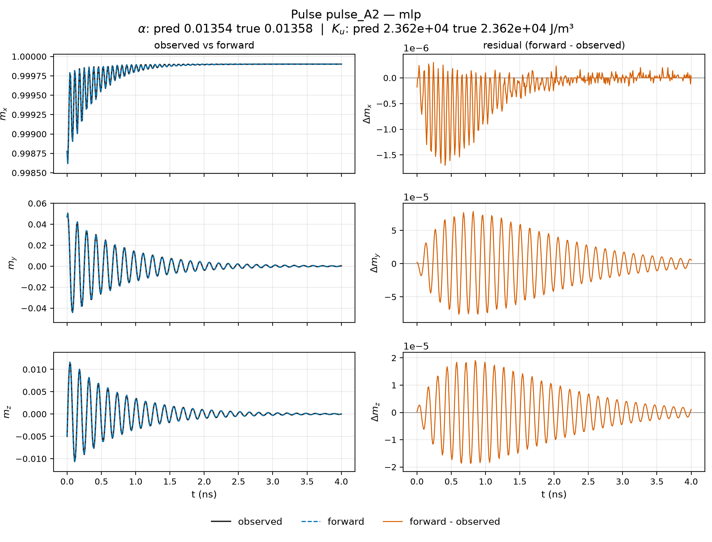 | 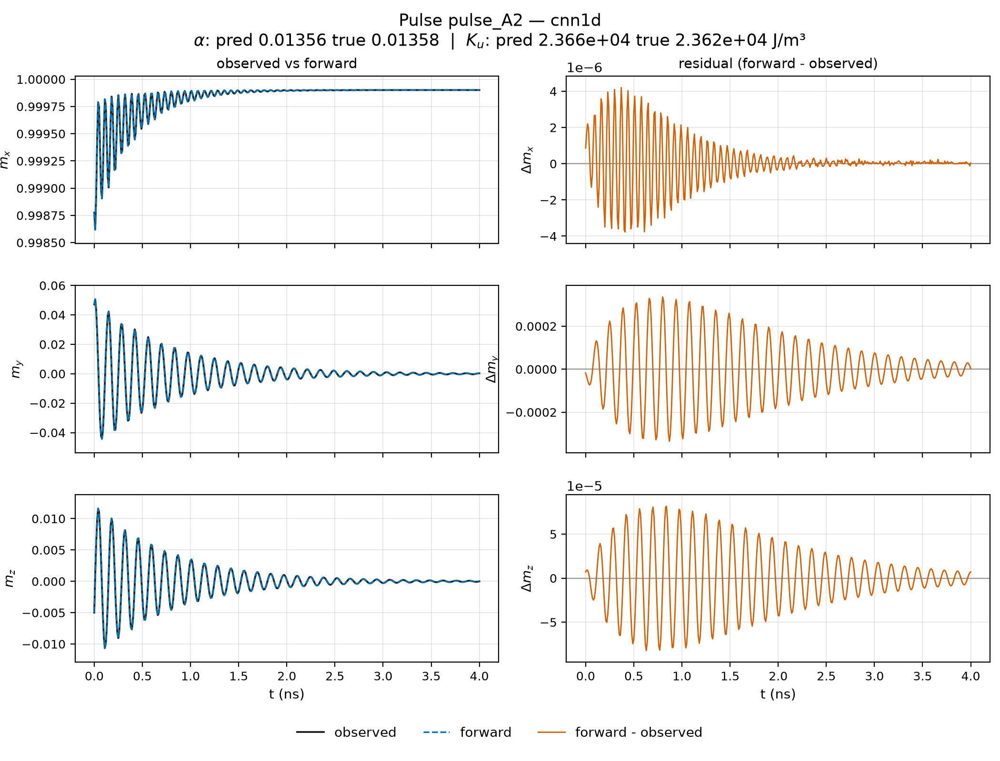 | 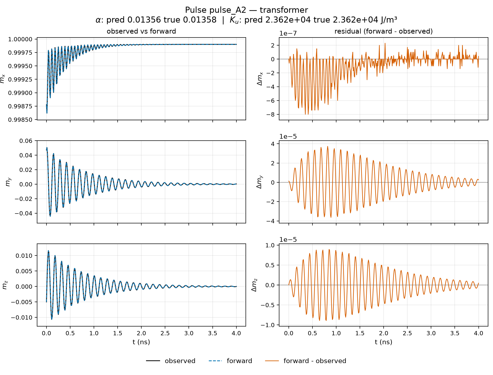 |

### A：α 上外推（α=0.02200, Ku=16000）

| MLP | CNN1D | Transformer |
|---|---|---|
| 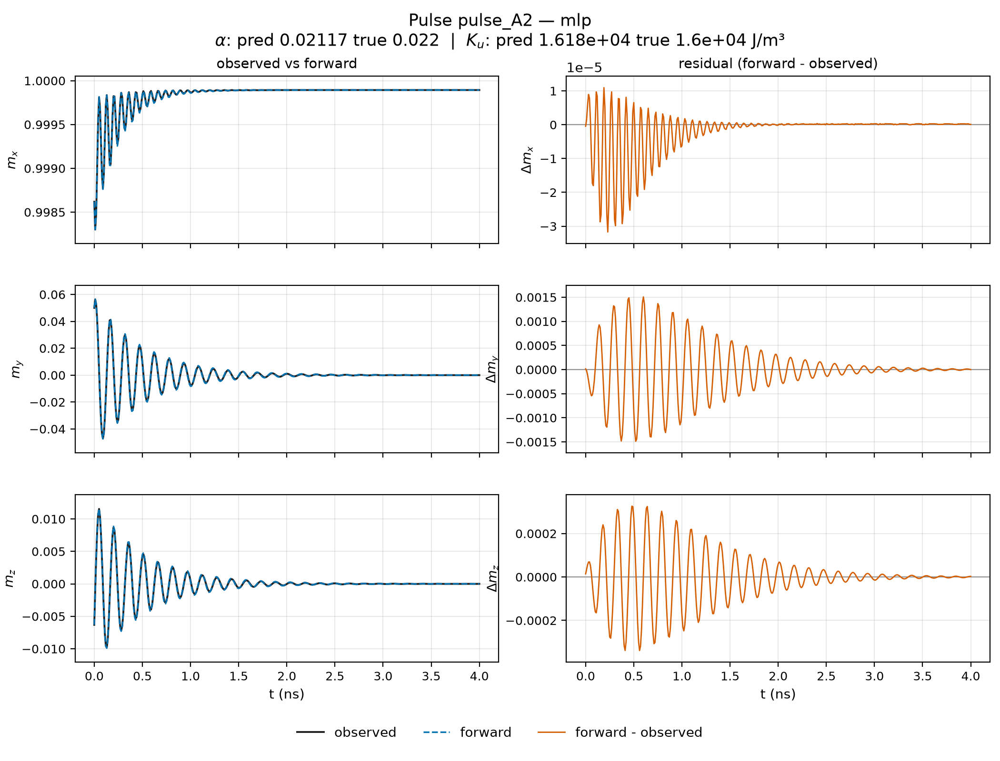 | 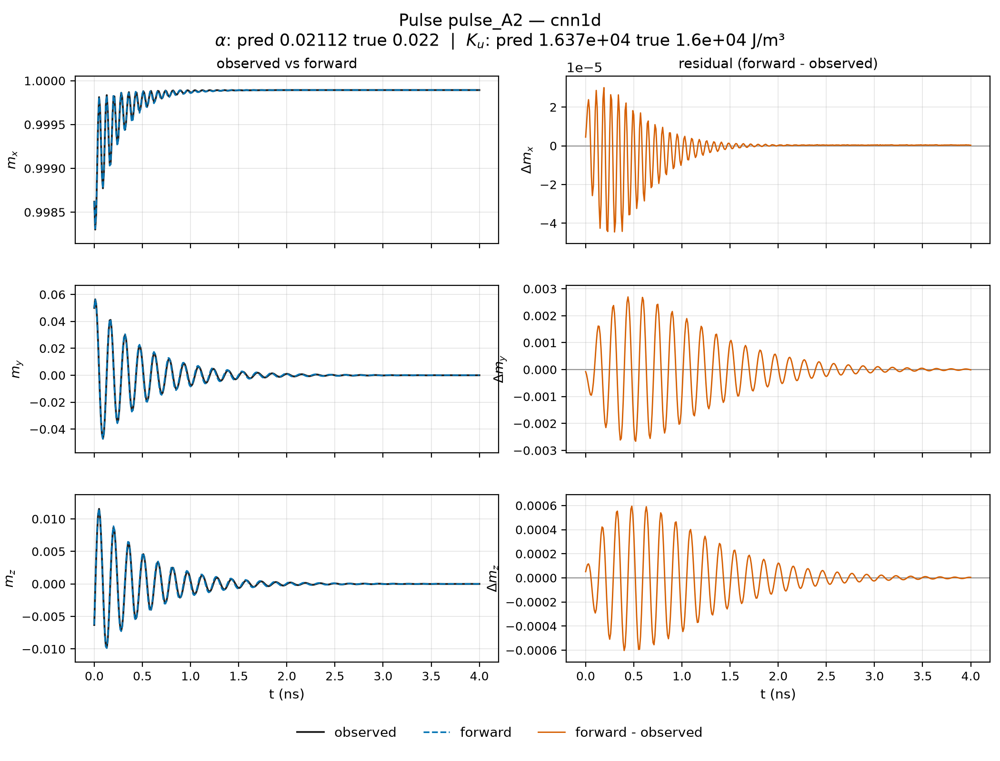 | 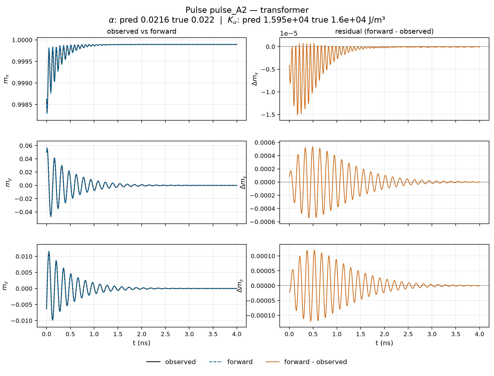 |

### B：Ku 上外推（α=0.01000, Ku=33000）

| MLP | CNN1D | Transformer |
|---|---|---|
| 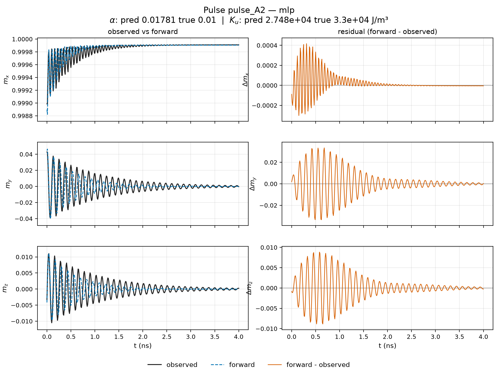 | 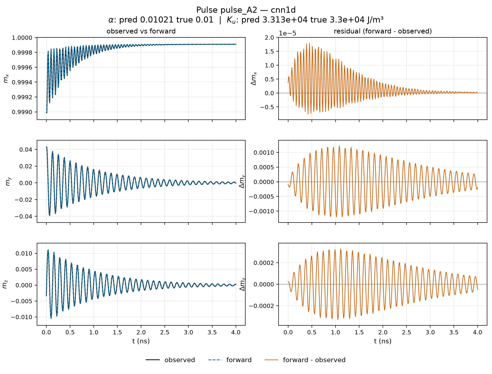 | 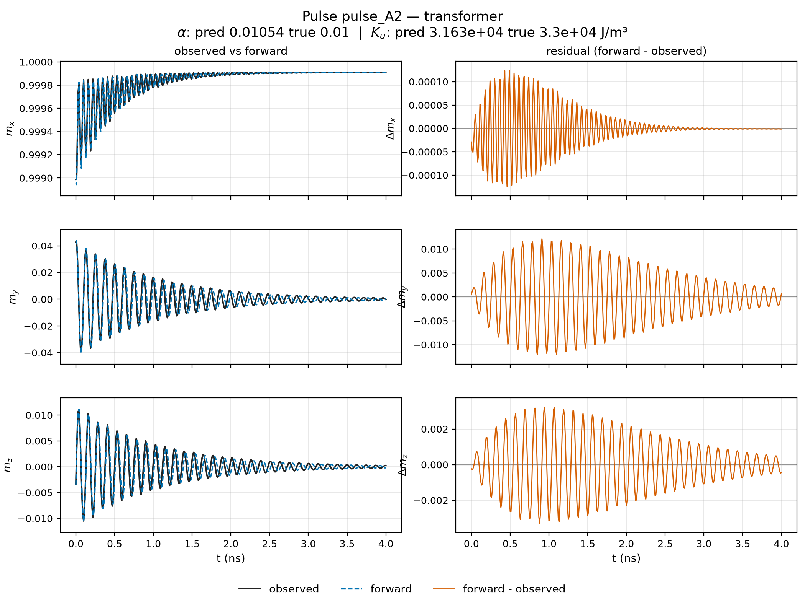 |

### C：双上外推（α=0.02200, Ku=33000）

| MLP | CNN1D | Transformer |
|---|---|---|
| 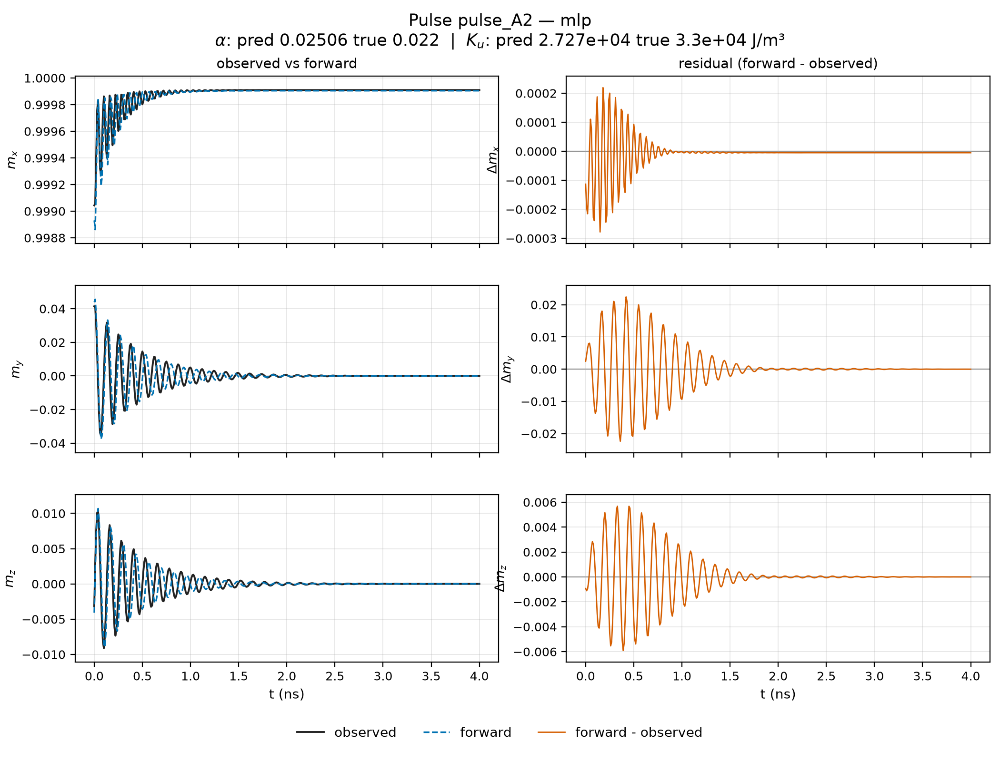 | 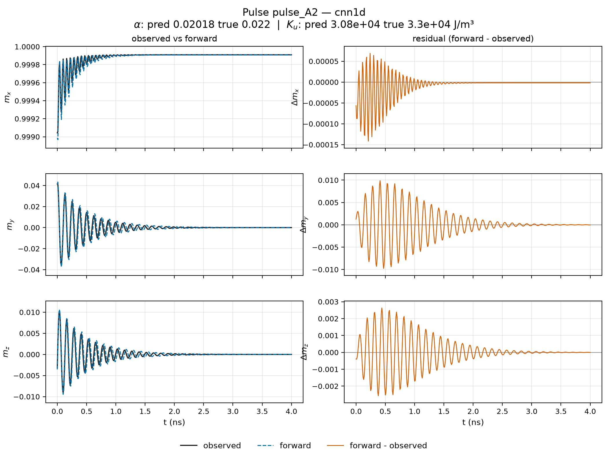 | 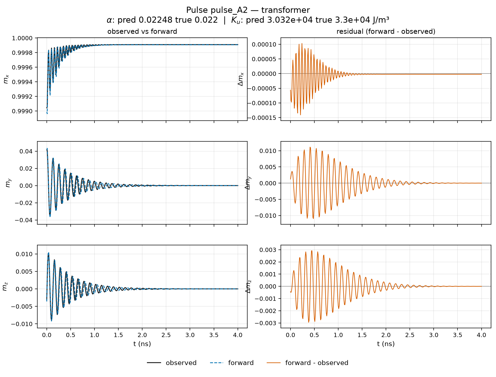 |
